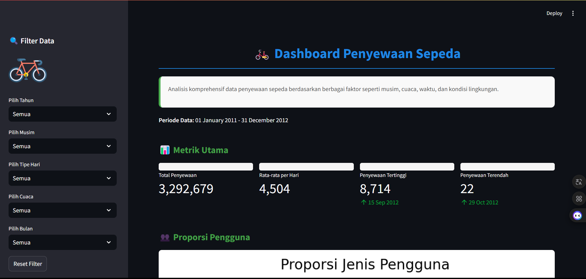
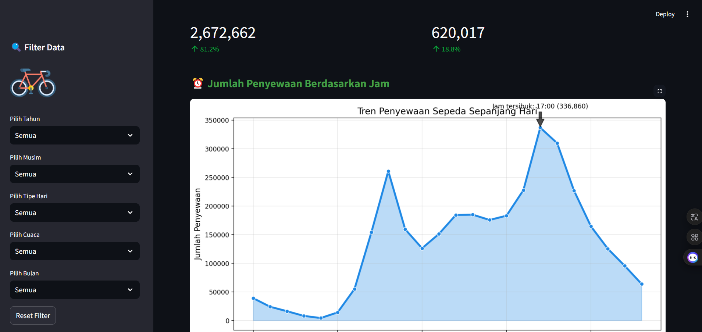
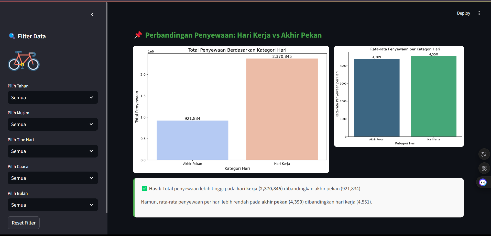
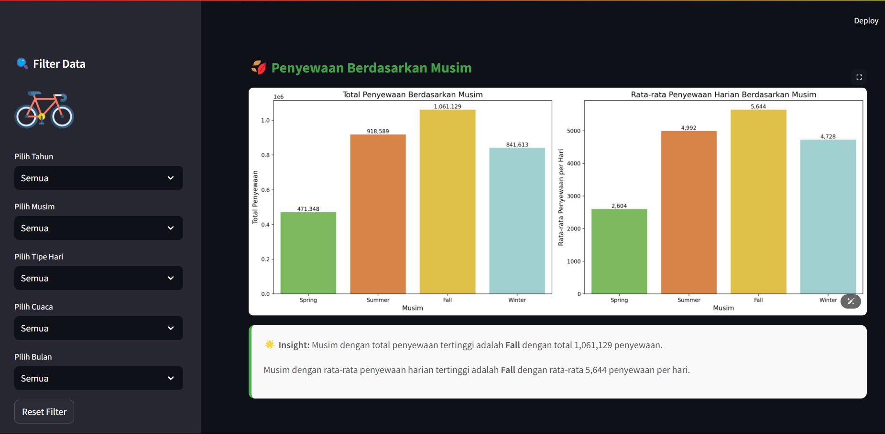
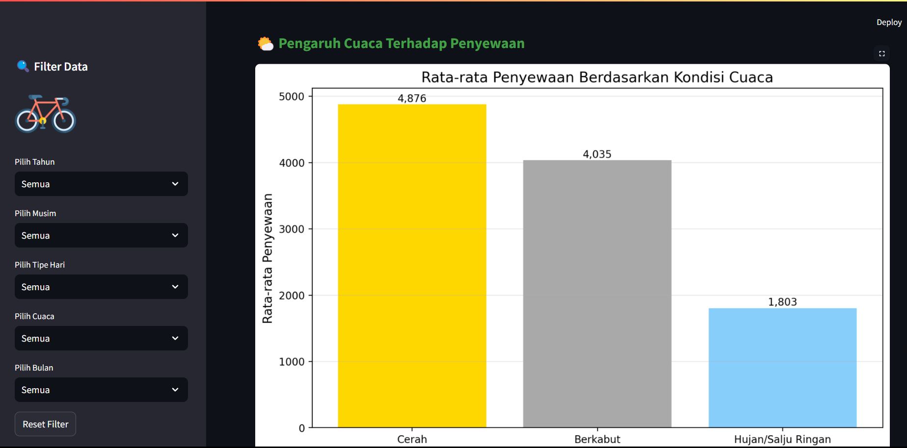

# 🚲 Analisis Dataset Bike Sharing 🚲






Proyek analisis data komprehensif untuk mengeksplorasi dan memvisualisasikan pola penggunaan sepeda.

## 🔧 Persiapan Lingkungan

Pilih salah satu metode berikut untuk menyiapkan lingkungan Anda:

### Anaconda (Windows, macOS, Linux)
```bash
conda create --name bike-sharing-env python=3.9
conda activate bike-sharing-env
pip install -r requirements.txt
```

### Shell/Terminal (Windows, macOS, Linux)
```bash
mkdir bike_sharing_dashboard
cd bike_sharing_dashboard
python -m venv venv  # Membuat virtual environment
source venv/bin/activate  # Untuk macOS/Linux
venv\Scripts\activate  # Untuk Windows
pip install -r requirements.txt
```

### Pipenv (Windows, macOS, Linux)
```bash
mkdir bike_sharing_dashboard
cd bike_sharing_dashboard
pipenv install
pipenv shell
pip install -r requirements.txt
```

## 🚀 Menjalankan Aplikasi Streamlit

Cukup jalankan perintah berikut:

```bash
streamlit run dashboard/dashboard.py
```

## 📊 Fitur

- Visualisasi interaktif tren penyewaan sepeda
- Analisis musiman pola penggunaan
- Dampak cuaca terhadap penyewaan sepeda
- Analisis distribusi tipe pengguna

## 📁 Struktur Proyek

```
submission/
├── dashboard/
│   ├── main_data.csv
│   └── dashboard.py
├── data/
│   ├── data_1.csv
│   └── data_2.csv
├── notebook.ipynb
├── README.md
├── requirements.txt
└── url.txt
```

## 📚 Dependensi

Dependensi utama meliputi:
- pandas
- numpy
- matplotlib
- seaborn
- streamlit

Periksa `requirements.txt` untuk daftar lengkap.

## 📝 Lisensi

Proyek ini dilisensikan di bawah Lisensi MIT.